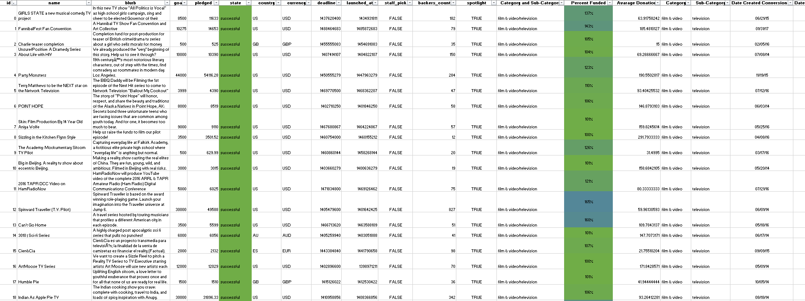
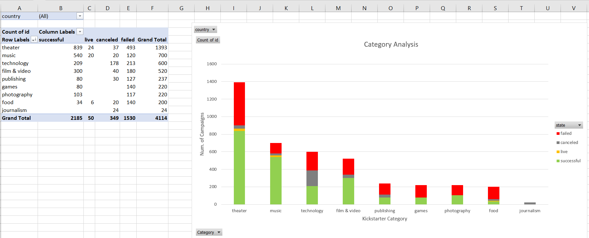
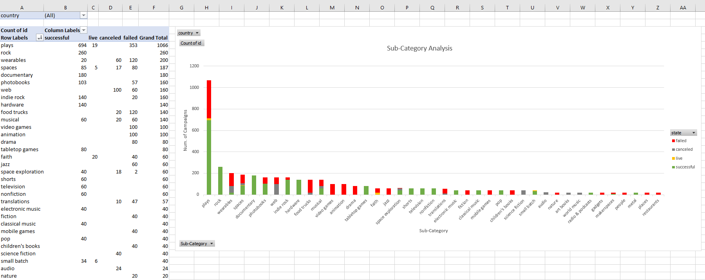
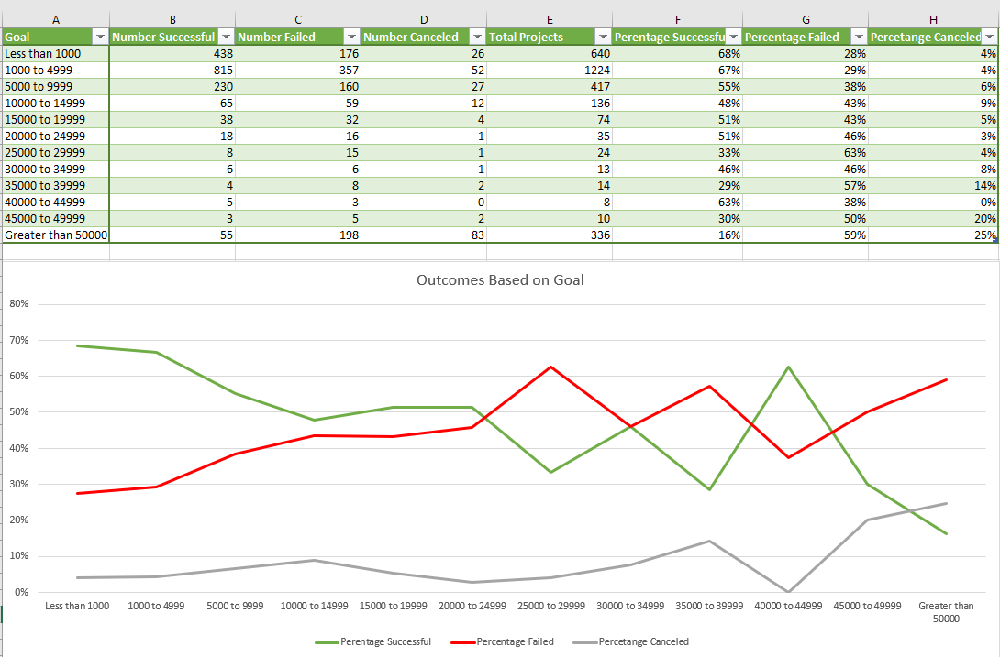

# Kickstart Analysis

- Organized and analyzed a database of 4,000 past Kickstarter projects utilizing Excel to uncovered market trends.
-	Used conditional formatting to differentiate a columns color depending on whether the associated campaign was successful, failed, canceled, or if it’s currently live.

-	Created pivot chart and line chart to analyze the success rate of the campaigns per category and subcategory.

-	Used COUNTIFS() formula to count number of successful, failed and canceled projects created with goals within listed ranges.
-	Created line chart that graphs the relationship between a goal’s amount, and it chances of success.

